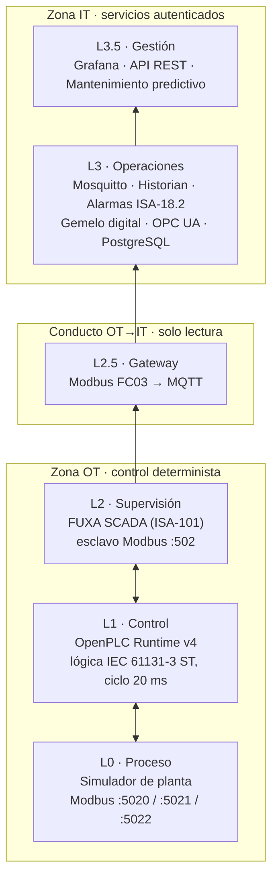
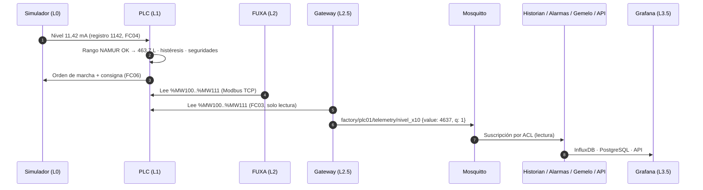

# Arquitectura — OT-Bridge

OT-Bridge es una **plataforma de referencia de integración IT/OT**: una planta de bombeo simulada de extremo
a extremo, desde el transmisor 4-20 mA hasta el dashboard de gestión, organizada según el modelo
**Purdue / PERA** y segmentada en **zonas y conductos IEC 62443**.

No es un programa: es un sistema de piezas especializadas (simulador, PLC, SCADA, broker, historian, API,
motor de alarmas, gemelo digital, OPC UA y dashboards) unidas por contratos de datos explícitos.

## 1. El proceso

Una balsa **TK-101** (0–1000 L) que llena la bomba **P-101** y vacía la válvula de consumo **V-101**.

| Equipo | Instrumentación | Señal |
|---|---|---|
| TK-101 | Transmisor de nivel LT-101 | 4-20 mA (NAMUR NE43: < 3,5 mA cable cortado, > 20,5 mA cortocircuito) |
| P-101 | Contactor con confirmación de marcha, variador de velocidad | Orden digital + confirmación + consigna % |
| V-101 | Válvula todo/nada de consumo | Orden digital |
| Línea | Caudalímetros FT-101 (entrada) y FT-102 (salida) | 4-20 mA |
| Seguridad | Seta de emergencia de campo y paro SCADA | Digital |

## 2. Niveles Purdue

| Nivel | Componente | Carpeta | Tecnología |
|---|---|---|---|
| L0 | Simulador físico: balsa, bomba con rampa, contactor, válvula, desbordamiento, 5 fallos inyectables | `ot/field/` | Python 3, pymodbus |
| L1 | PLC: acondicionamiento 4-20 mA, diagnóstico NAMUR, histéresis, reserva, jerarquía manual/auto, vigilancia del contactor (TON 3 s) | `ot/plc/` | OpenPLC v4, Structured Text |
| L2 | SCADA: 6 vistas ISA-101, faceplates, alarmas ISA-18.2, roles, vista de instructor | `ot/scada/` | FUXA 1.3.4, generado desde Python |
| L2.5 | Gateway: lee 12 registros (FC03) a 1 Hz y publica el contrato MQTT con calidad y heartbeat | `it/gateway/` | Python, pymodbus, paho-mqtt |
| L3 | Broker con ACL por servicio, historian con retenciones, motor de alarmas, gemelo de balance de masas, servidor OPC UA | `it/` | Mosquitto, InfluxDB 1.8, PostgreSQL 16, asyncua |
| L3.5 | 7 dashboards generados desde código, API REST con API key por cliente, scoring de mantenimiento | `it/grafana/`, `it/api/` | Grafana 11, Spring Boot 3.4 / Java 21 |

## 3. Recorrido de un dato

1. El **simulador** convierte la física en señales de campo: el nivel viaja como corriente (`mA × 100`).
2. El **PLC** valida la señal (NAMUR), la escala, decide y ordena. Es la **única autoridad de mando**.
3. El **SCADA** lee el estado procesado del PLC y permite operar por rol.
4. El **gateway** cruza la frontera en un solo sentido: lee el PLC y publica en MQTT. Nunca escribe.
5. En IT, cada servicio consume el contrato MQTT con sus propias credenciales y permisos.

## 4. Zonas y conductos (IEC 62443)

| Elemento | Definición | Controles |
|---|---|---|
| **Zona OT** | Simulador, PLC, SCADA | Modbus no autentica: se protege por segmentación (red Docker) y firewall de origen. El PLC arranca sin programa: solo un despliegue explícito lo pone en RUN |
| **Conducto OT→IT** | Gateway leyendo `:502` | Un flujo, un sentido, solo FC03, un único origen permitido |
| **Zona IT** | 10 servicios | MQTT con usuario + ACL por servicio, BBDD con roles, API key por cliente, OPC UA cifrado, puertos en loopback, contenedores endurecidos |

Detalle de controles y riesgos aceptados: [security.md](security.md). Puertos y firewall: [network.md](network.md).

## 5. Contratos de datos

| Contrato | Entre | Documento |
|---|---|---|
| Registros Modbus de campo (4-20 mA, órdenes, estación de instructor) | Simulador ↔ PLC ↔ FUXA | [register-map.md](register-map.md) |
| Registros del PLC `%MW100..%MW111` y bitmask de estado | PLC → SCADA / gateway | [mqtt-contract.md §5](mqtt-contract.md) |
| Topics y payloads MQTT, escalado, nodos OPC UA | Gateway → servicios IT | [mqtt-contract.md](mqtt-contract.md) |

Los valores cruzan la frontera **sin escalar** (enteros crudos del PLC) y cada consumidor aplica el divisor
documentado: no se pierde precisión ni cambia el tipo en el histórico.

## 6. Despliegue

| Modo | Uso | Cómo |
|---|---|---|
| **Un solo host** | Desarrollo y demostración | OT e IT comparten la red Docker `fuxa_default`; el gateway lee `openplc-runtime:502` directamente |
| **OT/IT separados** | Topología realista de planta | `modbus-proxy` publica `:502` en el host OT (firewall: solo el host IT); Mosquitto publica `:1883` para FUXA (firewall: solo el host OT) |

Guía paso a paso: [deployment.md](deployment.md).

## 7. Decisiones de arquitectura

Registradas como ADR en [`docs/adr/`](adr/).
