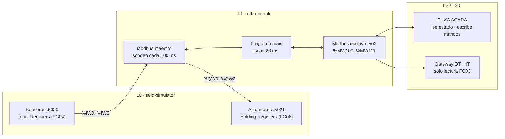

# PLC — OpenPLC Runtime v4: funcionamiento, código y configuración

Guía completa del nivel de control (Purdue L1): qué hace el PLC, cómo está programado, con quién habla y por qué
registros, y cómo configurarlo desde cero a mano en OpenPLC Editor.

| | |
|---|---|
| **Runtime** | OpenPLC Runtime **v4.1.10**, contenedor `otb-openplc` (imagen fijada por digest en `ot/scada/docker-compose.yml`) |
| **Lenguaje** | IEC 61131-3 **Structured Text** — `ot/plc/pous/programs/main.st` |
| **Ciclo** | Tarea cíclica `task0` cada **20 ms**, prioridad 1, instancia `instance0` del programa `main` |
| **Entradas / salidas** | Modbus TCP **maestro** contra el simulador de campo (`field-simulator:5020` y `:5021`) |
| **Interfaz SCADA / IT** | Modbus TCP **esclavo** en `:502` (`%MW100..%MW111`) para FUXA y el gateway OT→IT |
| **API de gestión** | `https://127.0.0.1:8443` (certificado autofirmado, solo en loopback) para OpenPLC Editor y `otb.py` |

---

## 1. Dónde está cada cosa

| Ruta | Qué contiene | ¿Se edita? |
|---|---|---|
| `ot/plc/pous/programs/main.st` | El programa: variables, entradas/salidas mapeadas y toda la lógica | **Sí**, es la fuente |
| `ot/plc/devices/remote/Sensores.json` | Dispositivo Modbus remoto de **entradas** (6 lecturas) | Sí (desde el Editor) |
| `ot/plc/devices/remote/Actuadores.json` | Dispositivo Modbus remoto de **salidas** (3 escrituras) | Sí (desde el Editor) |
| `ot/plc/devices/servers/HMI_Server.json` | Servidor Modbus esclavo `:502` | Sí (desde el Editor) |
| `ot/plc/project.json` | Proyecto del Editor: tarea de 20 ms e instancia | Sí (desde el Editor) |
| `ot/plc/devices/configuration.json` | Plataforma de destino (OpenPLC Runtime v4) | Rara vez |
| `ot/plc/dist/runtime-v4/` | **Compilado** por el Editor (C++ + `conf/*.json`), lo que se carga en el runtime | No: se regenera con *Build* |
| `ot/plc/deploy_plc.py` | Carga `dist/` en el runtime por API y lo pone en RUN | No |

## 2. Cómo se conecta con el resto de la planta



El PLC tiene **dos papeles Modbus a la vez**:

1. **Maestro (cliente) hacia el campo.** Cada 100 ms lee las 6 entradas del simulador y escribe sus 3 salidas.
   Equivale a las tarjetas de E/S de un PLC físico.
2. **Esclavo (servidor) hacia la supervisión.** Publica en `:502` su estado procesado y recibe los mandos del
   SCADA. El gateway IT también lee de aquí, pero **solo con FC03 (lectura)**.

Todo ocurre dentro de la red Docker `otb-ot`: ningún puerto Modbus se publica en el host
([network.md](network.md)).

## 3. El ciclo de ejecución

```
cada 100 ms (asíncrono)          cada 20 ms (tarea task0)
┌──────────────────────┐         ┌─────────────────────────────────────────────┐
│ Modbus maestro:      │         │ 1. copia %IW (imagen de entradas)           │
│  FC04 → %IW0..%IW5   │ ──────▶ │ 2. ejecuta main (toda la lógica)            │
│  FC06 ← %QW0..%QW2   │ ◀────── │ 3. publica %QW (salidas) y %MW (HMI)        │
└──────────────────────┘         └─────────────────────────────────────────────┘
```

- El programa nunca habla Modbus directamente: trabaja sobre **variables mapeadas** (`AT %IW`, `AT %QW`, `AT %MW`)
  que el runtime sincroniza con los dispositivos.
- Con `errorHandling: keep-last-value`, si se pierde la comunicación con el simulador, las entradas conservan el
  último valor leído (ver [§8](#8-comportamiento-ante-fallos)).

## 4. Mapa de entradas, salidas y memorias

### 4.1 Entradas — `%IW` (desde `field-simulator:5020`, Input Registers, FC04)

| Dirección PLC | Variable en `main.st` | Registro simulador | Señal | Escala |
|---|---|---|---|---|
| `%IW0` | `nivel_ma_x100` | 0 | Transmisor de nivel LT-101 | mA × 100 (400–2000 = 4–20 mA → 0–1000 L) |
| `%IW1` | `caudal_entrada` | 1 | Caudalímetro FT-101 (llenado) | mA × 100 (4–20 mA → 0–150 l/min) |
| `%IW2` | `caudal_salida` | 2 | Caudalímetro FT-102 (consumo) | mA × 100 (4–20 mA → 0–150 l/min) |
| `%IW3` | `confirmacion_marcha` | 3 | Confirmación del contactor de P-101 | 0 / 1 |
| `%IW4` | `seta_pulsada` | 4 | Seta de emergencia de campo | 0 libre / 1 pulsada |
| `%IW5` | `velocidad_real_bomba_pct` | 5 | Velocidad real de P-101 | 0–100 % |

### 4.2 Salidas — `%QW` (hacia `field-simulator:5021`, Holding Registers, FC06)

| Dirección PLC | Variable | Registro simulador | Orden | Escala |
|---|---|---|---|---|
| `%QW0` | `bomba_marcha` | 0 | Marcha de la bomba P-101 | 0 paro / 1 marcha |
| `%QW1` | `bomba_velo` | 1 | Consigna de velocidad de P-101 | 0–100 % (directo, sin 4-20 mA) |
| `%QW2` | `valvula_abrir` | 2 | Apertura de la válvula de consumo V-101 | 0 cerrada / 1 abierta |

> **Orden ≠ confirmación.** `%QW0` es lo que el PLC *manda*; `%IW3` es lo que el campo *confirma*. El PLC nunca da
> por hecho que la bomba arrancó: lo vigila (ver bloque 6).

### 4.3 Memorias — `%MW` (servidor `:502`, para SCADA y gateway)

En el esclavo Modbus de OpenPLC v4, los holding registers empiezan por `%QW` (direcciones 0–1023) y continúan con
`%MW` (1024–2047). Por eso `%MW100` está en la **dirección 1124**. FUXA numera desde 1 (`1125`).

| PLC | Variable | Dir. Modbus (0-based) | FUXA (1-based) | Sentido | Contenido |
|---|---|---|---|---|---|
| `%MW100` | `hmi_nivel_x10` | 1124 | 1125 | PLC → | Nivel en L × 10 |
| `%MW101` | `hmi_nivel_ma` | 1125 | 1126 | PLC → | Señal bruta del transmisor (mA × 100) |
| `%MW102` | `hmi_caudal_ent` | 1126 | 1127 | PLC → | Caudal de entrada en l/min × 10 |
| `%MW103` | `hmi_caudal_sal` | 1127 | 1128 | PLC → | Caudal de salida en l/min × 10 |
| `%MW104` | `hmi_velocidad` | 1128 | 1129 | PLC → | Velocidad real de la bomba (%) |
| `%MW105` | `hmi_estado` | 1129 | 1130 | PLC → | Bitmask de estado (tabla 4.4) |
| `%MW106` | `modo_manual` | 1130 | 1131 | → PLC | 0 automático / 1 manual |
| `%MW107` | `mando_manual_marcha` | 1131 | 1132 | → PLC | Marcha manual de P-101 |
| `%MW108` | `mando_manual_valvula` | 1132 | 1133 | → PLC | Apertura manual de V-101 |
| `%MW109` | `reset_fallos` | 1133 | 1134 | → PLC | Reset de fallos (pulso; el PLC lo devuelve a 0) |
| `%MW110` | `velocidad_manual_pct` | 1134 | 1135 | → PLC | Consigna manual 0–100 % |
| `%MW111` | `seta_scada` | 1135 | 1136 | → PLC | Paro de emergencia desde el SCADA |

Solo FUXA escribe en `%MW106..%MW111`. El gateway IT solo lee `%MW100..%MW111`.

### 4.4 Bitmask `hmi_estado` (`%MW105`)

| Bit | Valor | Significado |
|---|---|---|
| 0 | 1 | Contactor confirmado |
| 1 | 2 | Seta activa (física o SCADA) |
| 2 | 4 | Fallo de sensor de nivel (NAMUR) |
| 3 | 8 | Fallo de arranque / paro del contactor |
| 4 | 16 | Alarma de nivel muy alto (≥ 950 L) |
| 5 | 32 | Alarma de nivel muy bajo (≤ 100 L) |
| 6 | 64 | Consumo en reserva |
| 7 | 128 | Modo manual |
| 8 | 256 | Orden de marcha de la bomba |
| 9 | 512 | Orden de apertura de la válvula |

## 5. El programa, bloque a bloque

### Constantes (setpoints)

| Constante | Valor | Uso |
|---|---|---|
| `SP_ARRANQUE_BOMBA` | 300 L | En automático, la bomba arranca por debajo |
| `SP_LLENO` | 900 L | En automático, la bomba para por encima |
| `SP_RESERVA` | 200 L | Por debajo se cierra el consumo (reserva) |
| `SP_REARME_CONSUMO` | 250 L | Por encima se rehabilita el consumo |
| `SP_ALARMA_ALTA` / `SP_ALARMA_BAJA` | 950 L / 100 L | Alarmas de nivel |
| `MA_MIN_VALIDO` / `MA_MAX_VALIDO` | 350 / 2050 (3,5 / 20,5 mA) | Rango válido del transmisor (NAMUR NE43) |
| `VELOCIDAD_AUTO` | 75 % | Velocidad en automático y consigna inicial al pasar a manual |

### Bloque 1 · Acondicionamiento de entradas

```st
nivel_litros := (INT_TO_REAL(nivel_ma_x100) - 400.0) / 1600.0 * 1000.0;
```

Convierte la corriente (mA × 100) a unidades de ingeniería: 400 → 0 L, 2000 → 1000 L. Igual para los dos
caudales con un rango de 0–150 l/min.

### Bloque 2 · Diagnóstico y alarmas

```st
fallo_sensor := (nivel_ma_x100 < MA_MIN_VALIDO) OR (nivel_ma_x100 > MA_MAX_VALIDO);
seguridades_ok := NOT seta_activa AND NOT fallo_arranque AND NOT fallo_sensor;
```

Una señal por debajo de 3,5 mA es **cable cortado**; por encima de 20,5 mA, **cortocircuito**. Sin este control, un
cable roto (0 mA) se leería como "depósito vacío" y la bomba arrancaría en seco. Las alarmas de nivel se anulan
mientras el sensor está en fallo, porque su lectura no es fiable.

### Bloque 3 · Reserva de consumo (con histéresis)

Por debajo de 200 L se activa `en_reserva` y se cierra la válvula de consumo. No se rehabilita hasta superar
250 L: los 50 L de banda evitan que la válvula abra y cierre continuamente alrededor del umbral.

### Bloque 4 · Regulación de nivel (con histéresis)

`bomba_auto_marcha` se activa a 300 L y se desactiva a 900 L, o ante un fallo de sensor. Entre ambos valores mantiene
el estado anterior: es un control todo/nada clásico con banda muerta.

### Bloque 5 · Jerarquía de mando

```st
IF (modo_manual <> 0) THEN orden_marcha := (mando_manual_marcha <> 0);
ELSE                       orden_marcha := bomba_auto_marcha; END_IF;
IF NOT seguridades_ok THEN orden_marcha := FALSE; END_IF;
```

1. **Las seguridades mandan sobre todo.** Seta, fallo de sensor o fallo de arranque anulan la orden de marcha, se
   pulse lo que se pulse en el SCADA.
2. **Manual o automático** decide quién da la orden.
3. **Cambio sin salto:** al pasar a manual, el mando manual hereda el estado de la bomba y la consigna se fija en
   75 %, para que la planta no reaccione de golpe.

### Bloque 6 · Vigilancia del contactor

```st
TON_ARRANQUE(IN := orden_marcha AND NOT contactor_cerrado, PT := T#3s);
TON_PARO(IN := NOT orden_marcha AND contactor_cerrado, PT := T#3s);
```

Si la orden y la confirmación discrepan más de 3 s en cualquier sentido (contactor quemado, pegado o sin
alimentación), se activa `fallo_arranque`, que es **enclavado**: solo se borra con un reset (`%MW109`) y sin la
seta activa. El reset se consume en el propio ciclo (el PLC lo devuelve a 0).

### Bloque 7 · Salidas físicas

- `bomba_marcha` refleja `orden_marcha`.
- `bomba_velo`: 0 % si no hay orden; en manual, la consigna del operador limitada a 0–100 (con 0 se usa el 75 %
  por defecto); en automático, el 75 %.
- `valvula_abrir`: en manual sigue el mando del operador (nunca con la seta activa); en automático, abierta mientras
  el consumo esté permitido.

### Bloque 8 · Publicación para el SCADA

Escala los valores a enteros (× 10) para no perder decimales en registros de 16 bits y compone el bitmask
`hmi_estado`. Es la única información que sale del PLC hacia arriba.

## 6. Cómo se carga en el runtime

| Vía | Cuándo | Qué hace |
|---|---|---|
| `python otb.py install` / `start` | Automático | Llama a `deploy_plc.py` como último paso |
| `python otb.py deploy-plc` | Tras reiniciar solo el contenedor del PLC | Ídem, solo el PLC |
| **Build** en OpenPLC Editor | Al desarrollar la lógica | El Editor compila, sube y arranca |

`deploy_plc.py`:

1. Espera a que el runtime responda en `https://127.0.0.1:8443`.
2. Inicia sesión con `OPENPLC_USER` / `OPENPLC_PASSWORD` de `it/.env`. En un runtime nuevo crea esa cuenta de
   administrador: la primera cuenta solo se puede crear una vez, y como la API solo escucha en loopback, nadie
   puede adelantarse.
3. Para el PLC, sube `dist/runtime-v4` como ZIP (`/api/upload-file?clean=1`) y espera a que termine la
   compilación dentro del contenedor.
4. Lo pone en RUN y comprueba el estado.

> **Arranque seguro ([ADR 0004](adr/0004-arranque-seguro-del-plc.md)).** El contenedor borra el programa compilado
> cada vez que arranca: tras un corte de luz o un reinicio, **el PLC queda parado** hasta un despliegue explícito.

## 7. Configurarlo a mano en OpenPLC Editor

Esta sección reproduce desde cero el proyecto `ot/plc`. Los nombres exactos de los menús pueden variar algo entre
versiones del Editor; los valores son los de los ficheros del repositorio, que son la referencia.

### 7.1 Requisitos

- [OpenPLC Editor v4](https://autonomylogic.com/).
- La plataforma en marcha (`python otb.py install`), para tener el runtime y el simulador.
- La contraseña del runtime: `python otb.py credentials --show` (usuario `otb-admin`).

### 7.2 Proyecto y programa

1. **Nuevo proyecto** con destino **OpenPLC Runtime v4**.
2. Crea un **programa** (POU) llamado `main` en **Structured Text**.
3. Copia el contenido de `ot/plc/pous/programs/main.st`. Incluye las declaraciones `AT %IW…`, `AT %QW…` y
   `AT %MW…`, que enlazan cada variable con su dirección.
4. En la configuración de recursos, crea la **tarea** `task0`: cíclica, intervalo `T#20ms`, prioridad `1`. Asocia
   la **instancia** `instance0` al programa `main`.

### 7.3 Dispositivo remoto «Sensores» (entradas)

| Campo | Valor |
|---|---|
| Protocolo | Modbus TCP |
| Host / puerto | `field-simulator` / `5020` |
| Slave ID / timeout | `1` / `1000 ms` |

Crea **6 grupos de E/S**, uno por registro, todos con **función 4 (Read Input Registers)**, longitud 1, ciclo
100 ms y tratamiento de error *keep last value*:

| Grupo | Offset | Punto de E/S | Tipo |
|---|---|---|---|
| `nivel_ma_x100` | 0 | `%IW0` | Analog Input (Input Register) |
| `caudal_entrada` | 1 | `%IW1` | Analog Input (Input Register) |
| `caudal_salida` | 2 | `%IW2` | Analog Input (Input Register) |
| `confirmacion_marcha` | 3 | `%IW3` | Analog Input (Input Register) |
| `seta_pulsada` | 4 | `%IW4` | Analog Input (Input Register) |
| `velocidad_real_bomba_pct` | 5 | `%IW5` | Analog Input (Input Register) |

### 7.4 Dispositivo remoto «Actuadores» (salidas)

Mismos datos de conexión, con puerto **`5021`**. Crea **3 grupos** con **función 6 (Write Single Register)**,
longitud 1, ciclo 100 ms y *keep last value*:

| Grupo | Offset | Punto de E/S | Tipo |
|---|---|---|---|
| `bomba_marcha` | 0 | `%QW0` | Analog Output (Single Register) |
| `bomba_velo` | 1 | `%QW1` | Analog Output (Single Register) |
| `valvula_abrir` | 2 | `%QW2` | Analog Output (Single Register) |

### 7.5 Servidor Modbus «HMI_Server»

| Campo | Valor |
|---|---|
| Protocolo | Modbus TCP (esclavo) |
| Interfaz / puerto | `0.0.0.0` / `502` (dentro del contenedor; no se publica en el host) |

No hace falta declarar registros: el servidor expone toda la memoria del PLC según el mapa de la §4.3.

### 7.6 Compilar, cargar y comprobar

1. **Conectar** con el runtime: `https://localhost:8443`, usuario `otb-admin`. El certificado es autofirmado.
2. **Build:** el Editor compila, sube el programa y lo pone en RUN.
3. **Comprobar:**
   - FUXA → **Diagnóstico** muestra `%MW100..%MW111` con valores vivos;
   - FUXA → **Simulador**: la columna *PLC (medido)* coincide con *Campo (real)*;
   - `docker logs --tail 30 otb-openplc` muestra `PLC State: RUNNING` y las conexiones a `field-simulator`.
4. Para que `otb.py` despliegue esta versión, copia la salida del Build (`build/OpenPLC Runtime v4/src/`) sobre
   `ot/plc/dist/runtime-v4/` y haz commit.

## 8. Comportamiento ante fallos

| Situación | Qué detecta el PLC | Reacción |
|---|---|---|
| Cable del transmisor cortado (< 3,5 mA) | `fallo_sensor` | Para la bomba, cierra el consumo, anula alarmas de nivel |
| Cortocircuito del transmisor (> 20,5 mA) | `fallo_sensor` | Igual que el anterior |
| Bomba averiada | `fallo_arranque` a los 3 s (la bomba no confirma la marcha) | Retira la orden; requiere reset |
| Contactor que no confirma | `fallo_arranque` a los 3 s | Para la bomba; requiere reset |
| Seta de campo o SCADA | `seta_activa` | Para la bomba y cierra la válvula en cualquier modo |
| **Pérdida de comunicación con el simulador** | **No se detecta** (*keep last value*) | Las entradas se congelan en su último valor |

> **Limitación conocida.** Con *keep last value*, si el campo deja de responder el PLC sigue trabajando con datos
> congelados. Una mejora natural es añadir un vigilante de comunicaciones: por ejemplo, una señal de vida
> (*heartbeat*) del simulador cuyo cambio vigile un temporizador, que pase a modo seguro si deja de variar.

## 9. Cambiar la lógica o añadir una señal

1. **Lógica:** edita `main.st` en el Editor, prueba con *Build* contra tu runtime y actualiza `dist/` (§7.6).
2. **Nueva entrada o salida:** añade el registro en el simulador (`ot/field/config.py`), el grupo de E/S en el
   dispositivo correspondiente y la variable `AT %IW…` / `AT %QW…` en `main.st`.
3. **Nueva variable para el SCADA:** declárala `AT %MW112` (o siguiente), y actualiza a la vez:
   - el contrato: [register-map.md](register-map.md) y [mqtt-contract.md](mqtt-contract.md) §5;
   - el gateway (`it/gateway/config.yaml`), si debe llegar a IT;
   - las etiquetas de FUXA (`ot/scada/hmi/generator/model.py`) y, si procede, Grafana.

El contrato de registros es la fuente de verdad: cualquier cambio que no se refleje en todos sus consumidores
rompe el escalado o la semántica en algún punto de la cadena.

## 10. Diagnóstico rápido

| Síntoma | Comprobación | Causa habitual |
|---|---|---|
| SCADA con `???` / «SIN DATOS» | `python otb.py status` | PLC sin programa tras reiniciar → `python otb.py deploy-plc` |
| El PLC no pasa a RUN | `docker logs --tail 50 otb-openplc` | Error de compilación: revisa el ST con *Build* en el Editor |
| Valores congelados | Vista *Simulador*: ¿cambia la columna *Campo*? | Simulador parado: `docker logs otb-field-simulator` |
| El Editor no conecta | `https://localhost:8443` desde el navegador | Runtime parado o credenciales distintas a `it/.env` |
| Ver los registros en vivo | FUXA → **Diagnóstico** (`%MW100..%MW111` escalados) | Con OT/IT en hosts separados también `python it/scripts/test_read_plc.py <host OT>` |
